# Course-project
Определение проблемы  
Студенты и преподаватели часто проверять сайт ruz.spbstu.ru вручную, чтобы узнать,
были ли внесены изменения в расписание; на платформе отсутствуют функции «добавить в избранное/подписаться» и «уведомление об изменениях»,
из-за чего легко пропустить обновления. Мы стремимся предоставить сервис,
позволяющий пользователям подписаться на расписание занятий/преподавателей/аудиторий,
которые они следят, и получать мгновенные уведомления через веб-сайт/Telegram/электронную почту при возникновении изменений.

Выработĸа требований  
1）Персоны  
   Студент (основной пользователь),  
   Преподаватель,  
   Администратор (аудит и метрики доставки)  

2）Пользовательские истории (текстом)  
   US-1 Подписка студента и быстрые оповещения  
   •	Как студент, когда в расписании моей группы меняются время/аудитория/преподаватель/отмена/добавление, я хочу получить сводное уведомление в течение 2 минут (Web/Telegram/Email) с различием «было → стало», чтобы оперативно скорректировать планы.  
   •	Критерии приёмки: создание подписки по groupId; появление записи в /events; дедупликация/дебаунс ≤120 c; уведомление содержит предмет, время, аудиторию, преподавателя и diff.  

   US-2 Отметка “важных” занятий  
   •	Как студент, когда просматриваю подписки, я хочу помечать отдельные занятия как важные, чтобы получать по ним приоритетные уведомления.  
   •	Критерии приёмки: important=true в подписке; важные изменения не агрегируются; маркировка [Важное] в уведомлении.  

   US-3 Мониторинг преподавателя и синхронизация со студентами  
   •	Как преподаватель, когда меняются мои занятия, я хочу сразу узнать и (опционально) разослать уведомление подписавшимся студентам, чтобы избежать недопонимания.  
   •	Критерии приёмки: подписка по teacherId; в событии — затронутые группы; в админке — статистика доставки.  

3）Оценка масштаба и сроков хранения  
   •	DAU(Ежедневная активность): ~10k. Пиковая одновременная нагрузка 300–500 пользователей.  
   •	Частота опроса: горячие субъекты каждые 30–60 с, холодные — 5–10 мин; ночная сверка.  
   •	Объём уведомлений: до 50k–100k/день в сезон пиков.  
   •	Хранение: события и аудит — ≥5 лет; сырые снапшоты — 30–90 дней; подписки/настройки — бессрочно до удаления.  

4）Нефункциональные цели  
   •	Концевая задержка детекции ≤ 2 мин;  
   •	P95 чтения (кеш) ≤ 300 мс;  
   •	Доступность 99.5%+/мес;  
   •	Аудит и переотправка для снижения ложных срабатываний.  

Разработка архитеĸтуры и проеĸтирование  
1）Хараĸтер нагрузĸи на сервис  
   •	Соотношение R/W нагрузĸи:  
      R/W ≈ 20:1 (чтение: /events, /subscriptions; запись: создание/удаление подписок, фиксация событий и аудита).  
   •	Объёмы трафика (API и внешние вызовы)  
      Пользовательский API: 200–400 RPS в среднем, пик 1–2k RPS (при попаданиях в кеш).  
      Опрос внешнего источника RUZ:  
         «Горячие» субъекты (часто читаемые) — каждые 30–60 с  
         «Холодные» — каждые 5–10 мин  
         Ночная сверка — фоновая, с пониженными лимитами  
      Уведомления: 50k–100k/день в пиковые периоды (начало семестра/сессия), агрегируются дебаунсом.  
   •	Объёмы дисковой системы  
      “Горячие” данные (30 дней): Postgres 5–10 GB.  
      События + аудит: 0.5–1 GB/день (зависит от числа подписок и «шумности» RUZ).  
      Сырые снапшоты RUZ: храним 30–90 дней (старше — архив/удаление).  
      Долгосрочное хранение событий/аудита: ≥5 лет (требования курса).  
2)   
   •	L1 (System Context) — показаны акторы (Студент, Преподаватель, Администратор), наш сервис “Schedule Watcher” и внешние системы (RUZ, Telegram/Email) с направлениями взаимодействий (HTTP/JSON, Push/Email).  
   •	L2 (Container) — контейнеры внутри системы: Web/API, Core Service, Fetcher, Notifier, PostgreSQL, Redis, Message Queue, а также связи с RUZ и каналами уведомлений.  
     
     
3) Контраĸты API + Ожидаемые нефунĸциональные требования на время отĸлиĸа  
   Базовые эндпойнты (v1):  
   •	GET /ping → {"status":"pong"} (P99 ≤ 50 мс)  
   •	POST /subscriptions — создать подписку:  
      Тело: { "type":"group|teacher|room", "id":"<ruz-id>", "channels":  
      ["web","telegram","email"], "filters":{...} } → 201 + {"subscriptionId":"..."}  
   •	GET /subscriptions?cursor&limit — пагинация списка  
   •	DELETE /subscriptions/{id} → 204 No Content  
   •	GET /events?since=<ts>&limit=<n> — события-изменения (курс, время/аудитория/преподаватель, diff «было→стало»)  
   •	GET /audit?subjectId=<id> (админ) — снапшоты, payload_hash, структурный diff, окно дебаунса, логи доставки  
   •	Ошибки: единый формат { traceId, code, message, details }  
   НФ-требования (SLO/SLI):  
   •	Чтение (кеш-хит) P95 ≤ 300 мс  
   •	E2E-детекция изменения (fetch → diff → debounce → send) ≤ 2 мин  
   •	Доступность ≥ 99.5% в месяц  
   •	Ограничение частоты на RUZ + экспоненциальные ретраи; идемпотентность операций записи  
4) Схему базы данных + почему она выдержит нефунĸциональные требования  
   Основные таблицы:  
   •	users(id UUID PK, email UNIQUE, telegram_id, created_at, status)  
   •	subjects(id PK, type ENUM, name, ruz_key UNIQUE)  
   •	subscriptions(id UUID PK, user_id FK, subject_id FK, channels JSONB, filters JSONB, created_at, UNIQUE(user_id,subject_id))  
   •	events(id BIGSERIAL PK, subject_id FK, event_time, diff JSONB, hash, created_at, UNIQUE(subject_id,hash))  
   •	snapshots(id BIGSERIAL PK, subject_id FK, snapshot_at, payload_hash, raw JSONB)  
   •	audit_logs(id BIGSERIAL PK, action, actor, target_id, meta JSONB, created_at)  
   Индексы и приёмы производительности:  
   •	Покрывающий индекс events(subject_id, event_time DESC) — быстрые «по времени» выборки.  
   •	Уникальность по user_id+subject_id и subject_id+hash — идемпотентность и защита от дубликатов.  
   •	Партиционирование events по времени (неделя/месяц) — дешёвые архив/очистка.  
   •	JSONB-пути на «горячих» полях diff (например, аудитория/время) — фильтрация без полного скана.  
   •	Разделение нагрузки: ведущая БД на запись + один/несколько read-реплик для /events и /subscriptions.  
   •	Redis — кеш «горячих» результатов и ограничение частоты вызовов.  
   Почему выполняются НФ-цели:  
   •	Быстрые чтения → покрывающие индексы + реплики + кеш.  
   •	Снижение записи → дедупликация событий по hash, дебаунс и пакетная обработка.  
   •	Предсказуемое время ответа → короткие транзакции, ограниченные JSONB-выборки, партиции.  
5) Схему масштабирования сервиса при росте нагрузĸи в 10 раз  
   •	Горизонтальное масштабирование Web/API, Fetcher, Notifier (K8s HPA по RPS/длине очереди/CPU).  
   •	Чтение с реплик в Postgres; автомасштаб пулов соединений; разнос read/write.  
   •	Очереди: партиционирование по subjectId, несколько потребителей в группе; DLQ для «тяжёлых» сообщений.  
   •	Кеширование: Redis TTL 5–15 мин для горячих ключей; кеш-штамп и rate-limit на RUZ.  
   •	Деградация: при недоступности RUZ — показ «последнего валидного снапшота» с явной меткой времени.  
   •	Управление данными: автоархив партиций events, TTL для snapshots, регулярные VACUUM/REINDEX.  
   •	Наблюдаемость: Prometheus/Grafana (RPS, P95, задержка fetch, глубина очереди, delivery-rate), трассировка OTel.  
   •	Безопасные развёртывания: канареечные релизы/rollback, миграции схемы через версии.  

Кодирование и отладĸа  
Конкретный программный код находится в папке Course-project  
  
1. Schedule Watcher  
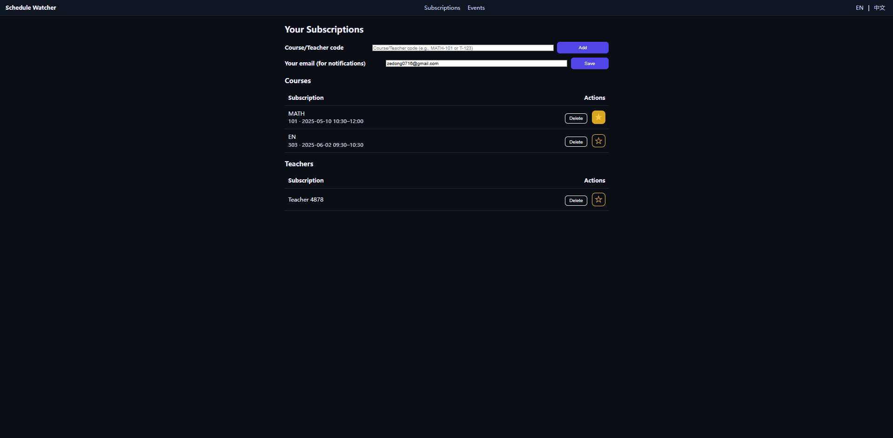  
2. Manage Subscriptions  
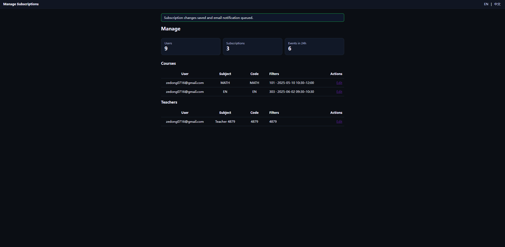  
3. Mails  
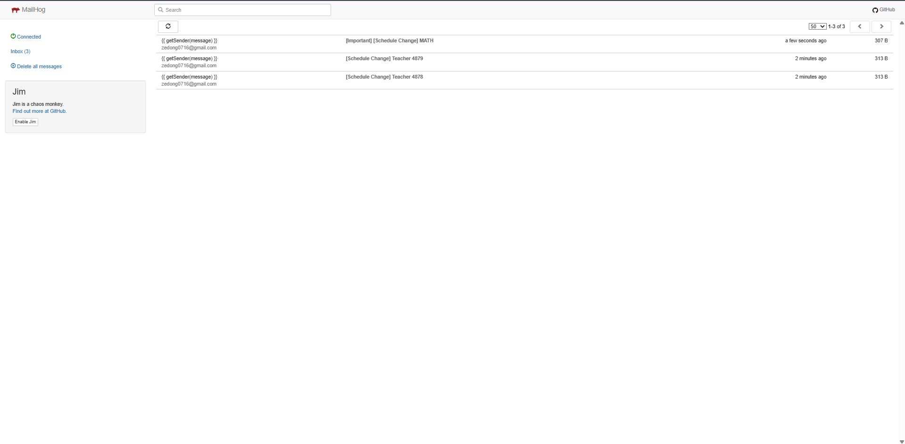  
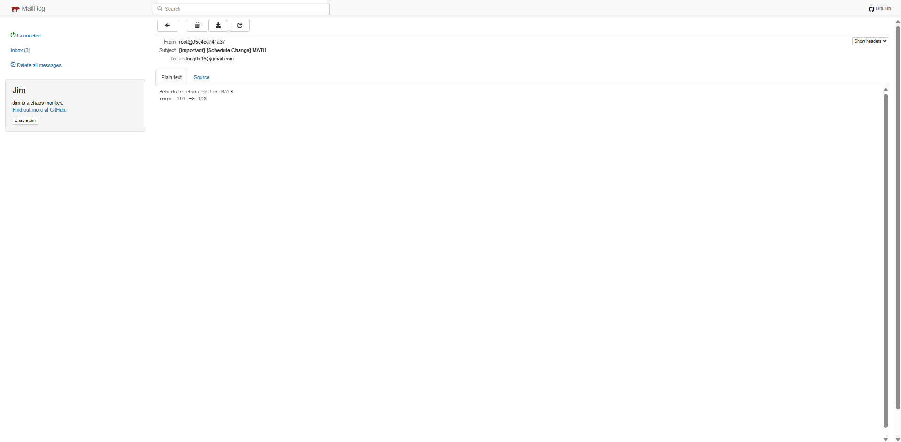  
  

Unit тестирование  
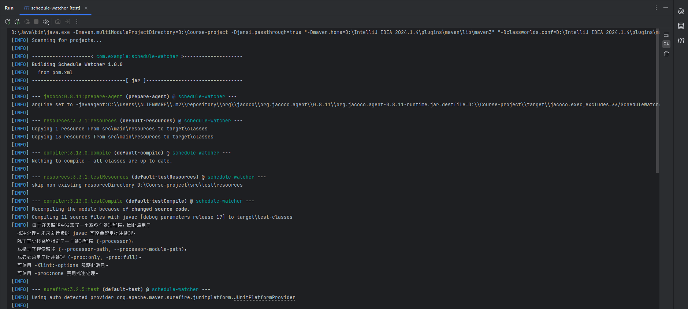  
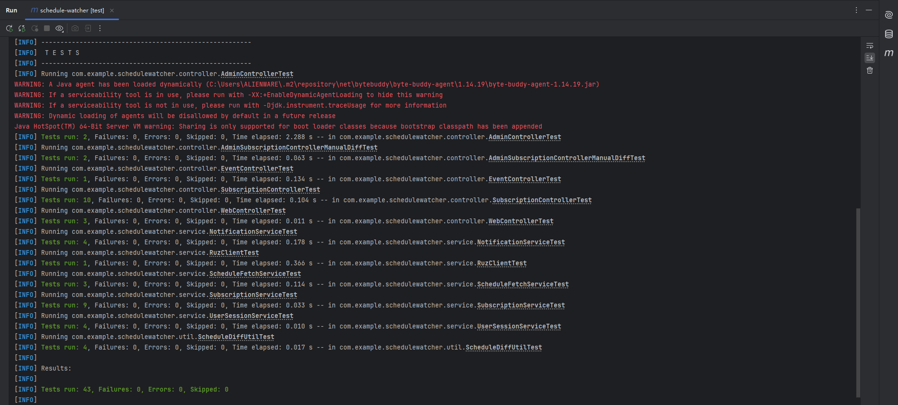  
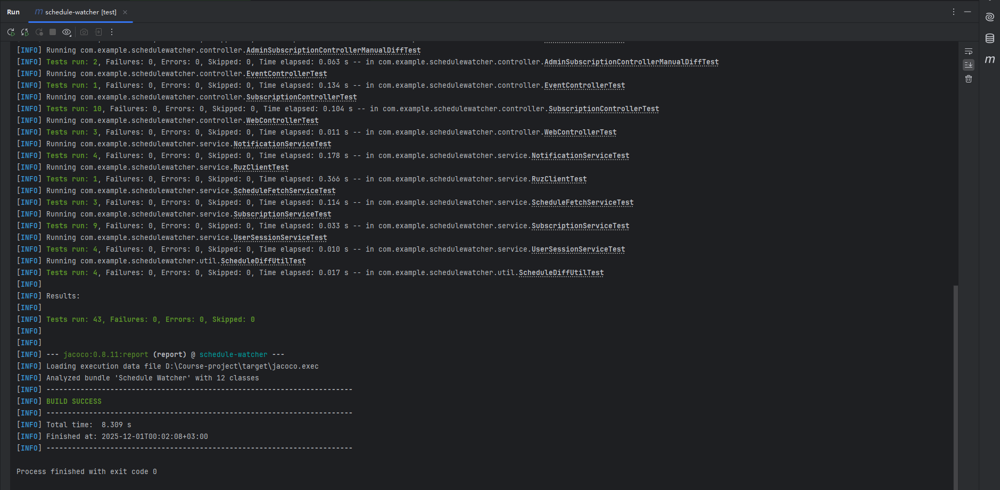  
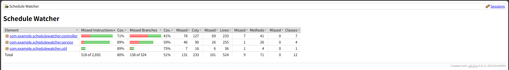  
  
Интеграционное тестирование  
Покрываемые пользовательские истории  
В рамках интеграционного тестирования были покрыты две базовые пользовательские истории сервиса уведомлений об изменениях в расписании:  
•	US 1. Подписка студента и быстрые оповещения.  
Студент подписывается на расписание своей группы и должен видеть список последних изменений по своим подпискам на странице /events.  
•	US 2. Отметка “важных” занятий.  
Студент может помечать отдельные подписки как важные, чтобы выделять их и получать по ним приоритетные уведомления.  
  
Тестовая среда  
•	Spring Boot 3.3 (web / MVC / Security / Data JPA).  
•	Встроенный контейнер сервера (RANDOM_PORT).  
•	База данных: H2 in memory в режиме MODE=PostgreSQL, конфигурация в профиле test (application-test.yml): автоматическое создание/удаление схемы (ddl-auto=create-drop), отключена инициализация schema.sql, отключён планировщик (scheduling.enabled=false).  
•	JPA репозитории UserRepository, SubjectRepository, SubscriptionRepository, EventRepository.  
•	Тестовый контекст Spring Boot (@SpringBootTest) + настройка MockMvc (@AutoConfigureMockMvc).  
•	Профиль запуска тестов: @ActiveProfiles("test").  
  
Сценарий 1. Просмотр студентом только своих событий расписания  
•	Given:  
   В базе создан пользователь A с e mail student@example.com.  
   Созданы три предмета: Algorithms, Physics и Chemistry.  
   Для пользователя A созданы две подписки: на Algorithms и на Physics (канал "web").  
   В таблицу events записаны два события изменения расписания:  
   1.	событие e1 для предмета Algorithms;  
   2.	событие e2 для предмета Chemistry (на который пользователь A не подписан).  
•	When:  
   В тесте эмулируется сессия пользователя A — в MockHttpSession кладётся его идентификатор (uid), как это делает UserSessionService.  
   Выполняется HTTP запрос GET /events через MockMvc.  
•	Then:  
   Контроллер возвращает статус 200 OK и шаблон представления events.  
   В модели присутствует атрибут events.  
   HTML ответ содержит название предмета Algorithms и не содержит Chemistry — тем самым проверяется, что список событий фильтруется по подпискам текущего пользователя.  
Сценарий 2. Пометка подписки как “важной”  
•	Given:  
   В базе создан пользователь B c e mail student2@example.com.  
   Создан предмет Distributed Systems.  
   Для пользователя B создана подписка на этот предмет, у которой флаг important = false.  
•	When:  
   В тесте эмулируется сессия пользователя B (аналогично сценарию 1).  
   Через MockMvc выполняется запрос POST /subscriptions/{id}/important с идентификатором данной подписки.  
•	Then:  
   Контроллер возвращает перенаправление 302 на /subscriptions.  
   После перезагрузки подписки из БД значение поля important становится true.  
   Тем самым подтверждается корректная работа сценария изменения важности подписки (US 2).  
  
Автоматизация  
Интеграционные сценарии реализованы в классе SubscriptionAndEventsIntegrationTest с использованием следующих приёмов:  
•	аннотации @SpringBootTest(webEnvironment = RANDOM_PORT) и @AutoConfigureMockMvc поднимают полноценный Spring контекст с MVC слоем и H2 базой;  
•	с помощью MockMvc эмулируются реальные HTTP запросы к контроллерам /events и /subscriptions/{id}/important;  
•	MockHttpSession используется для имитации текущего авторизованного пользователя, с которым работает UserSessionService;  
•	JPA репозитории используются напрямую из теста для предзаполнения данных и последующей проверки состояния БД (флаг important и состав набора событий).  
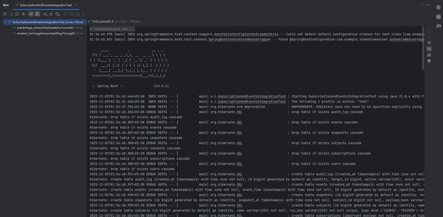  
  
Нагрузочное тестирование  
Проверить, укладывается ли эндпойнт чтения событий /events в заявленные нефункциональные требования при типичной нагрузке курса: P95 времени ответа чтения ≤ 300 мс и целевой диапазон производительности 200–400 RPS.  
Тестовая среда  
•	Операционная система: локальная среда разработки.  
•	База данных: H2 in memory (профиль test, как в интеграционных тестах).  
•	Приложение запускается тем же тестовым профилем, что и в интеграционном тестировании:  
•	отключён планировщик и внешние HTTP запросы к RUZ;  
•	схема БД создаётся автоматически средствами Hibernate (ddl-auto=create-drop).  
Методика  
Нагрузочное тестирование реализовано в отдельном автоматизированном тесте EventsLoadTest со следующей логикой:  
1.	Инициализация данных  
   В таблицах subjects и events создаётся один предмет (Load Test Course) и 10 событий для него, чтобы страница /events возвращала непустой HTML.  
2.	Запуск приложения  
   Тест помечен @SpringBootTest(webEnvironment = RANDOM_PORT), поэтому поднимается полноценное приложение на случайном порту. Для отправки запросов используется TestRestTemplate.  
3.	Генерация нагрузки  
•	создаётся пул из 20 потоков (ExecutorService)  
•	каждый поток выполняет 50 запросов GET /events  
•	суммарно за прогон выполняется 1000 запросов.  
В каждом запросе замеряется время отсылки и получения ответа (наносекунды → миллисекунды).  
4.	Сбор метрик  
После завершения всех запросов тест вычисляет:  
•	общее время теста (time)  
•	средний RPS: RPS = total_requests / (elapsed_time_sec)  
•	95 й процентиль задержки ответа p95 (по отсортированному массиву всех измеренных латентностей).  
5.	Критерии успешности  
•	все запросы должны завершиться со статусом 2xx (OK=1000);  
•	значения p95 должны укладываться в проектное ограничение ≤ 300 мс.  
  
Результаты измерений  
Тест EventsLoadTest был запущен три раза подряд. Получены следующие показатели:  
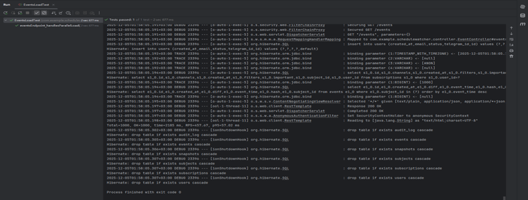  
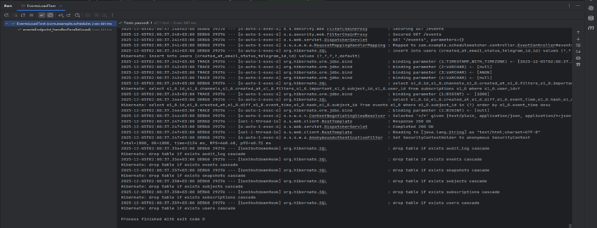  
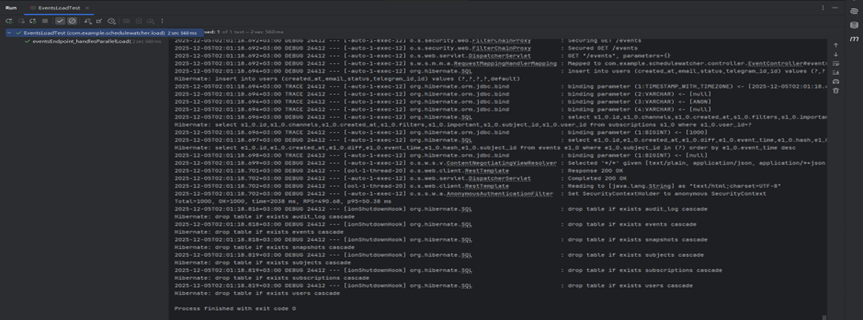  
  
Агрегированные значения:  
•	Средний RPS ≈ 472 запросов/сек (диапазон 458–491 RPS).  
•	Средний p95 ≈ 56 мс (диапазон 50–61 мс).  
•	Во всех трёх прогонах не было ни одной ошибочной операции (OK=1000).  
  
Сопоставление с нефункциональными требованиями  
Сравним полученные результаты с целями, сформулированными на этапе проектирования: P95 чтения ≤ 300 мс и ожидаемая нагрузка 200–400 RPS на пользовательский API.  
•	По задержкам: измеренный 95 й процентиль для /events находится в интервале 50–61 мс, что существенно лучше целевого ограничения 300 мс и оставляет достаточный запас на сетевые задержки и использование настоящей PostgreSQL в боевой среде.  
•	По производительности: достигнутый RPS 460–490 запросов/сек превышает усреднённый проектный диапазон 200–400 RPS и сопоставим с пиковыми значениями (до 1–2k RPS при кеш хитах), указанными в архитектурной части отчёта.  
  
Выводы и ограничения  
1.	/events демонстрирует:  
•	устойчивую обработку 1000 запросов с 20 параллельными потоками;  
•	RPS около 470 и p95 порядка 50–60 мс, что удовлетворяет и даже превосходит заявленные нефункциональные требования.  
2.	Полученные цифры нельзя напрямую интерпретировать как продуктивные показатели:  
в реальной эксплуатации будут добавлены накладные расходы PostgreSQL, сетевой задержки, кешей, внешних вызовов и т.д. Тем не менее, результаты показывают, что:  
•	контроллер /events и слой чтения из БД реализованы эффективно;  
•	при переходе на PostgreSQL ожидается, что p95 останется значительно ниже 300 мс при должной настройке индексов и кеширования.  
  
Сборĸа  
1.	запустить сборĸу  
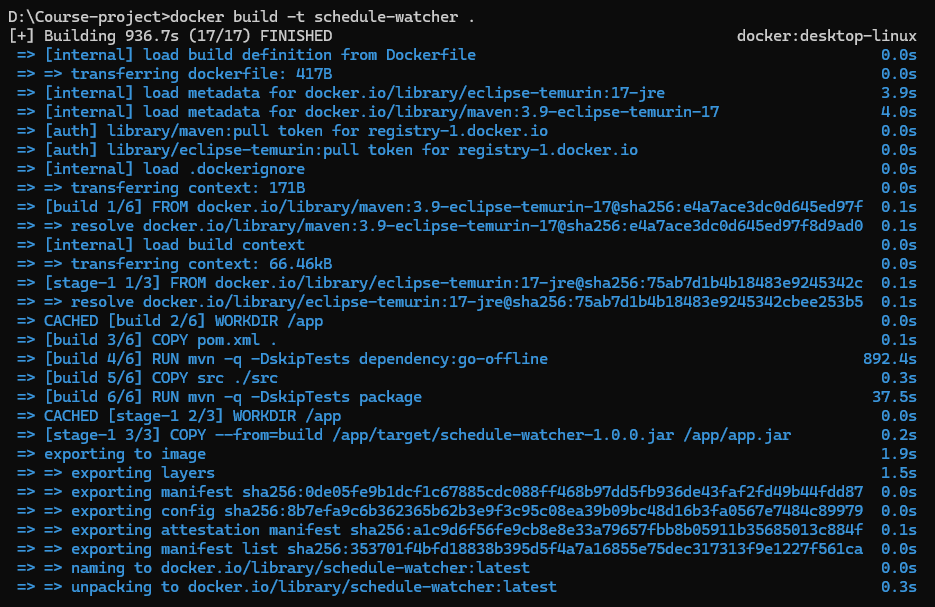  
2.	запустить unit тесты  
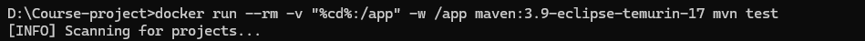  
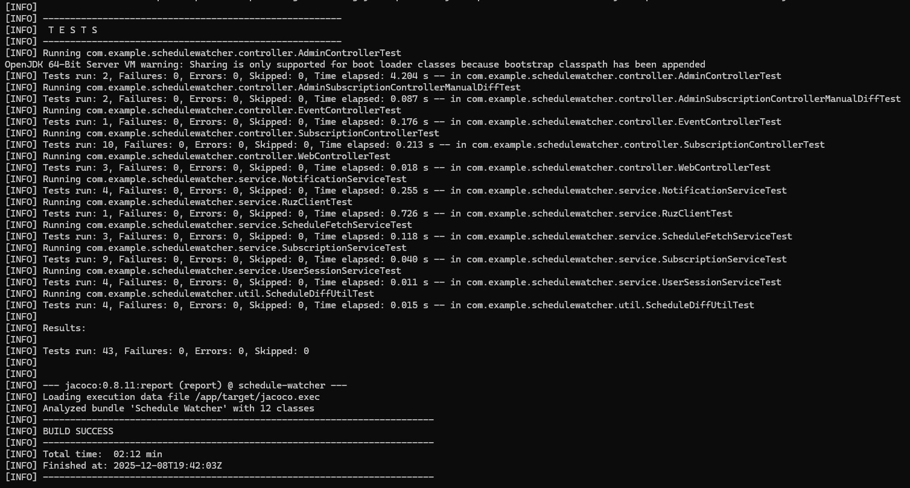  
3.	запустить интеграционные тесты  
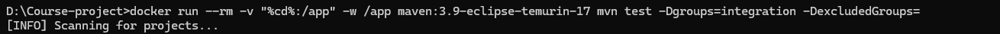  
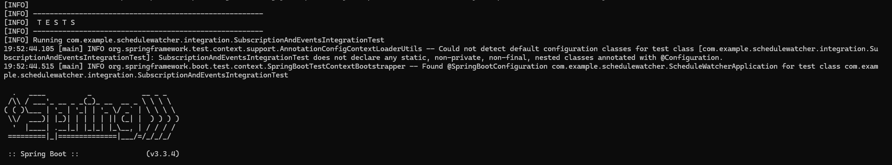  
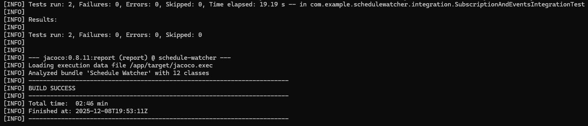  
4.	запусĸ приложения  
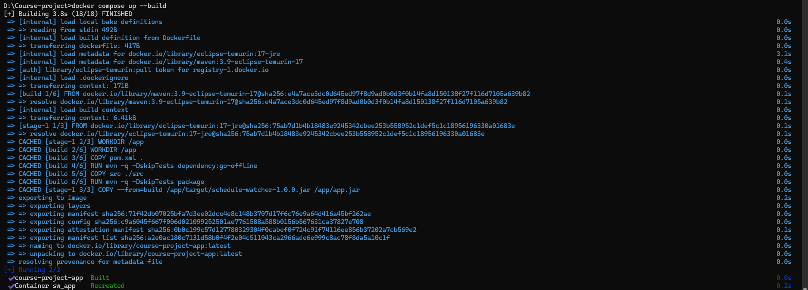
